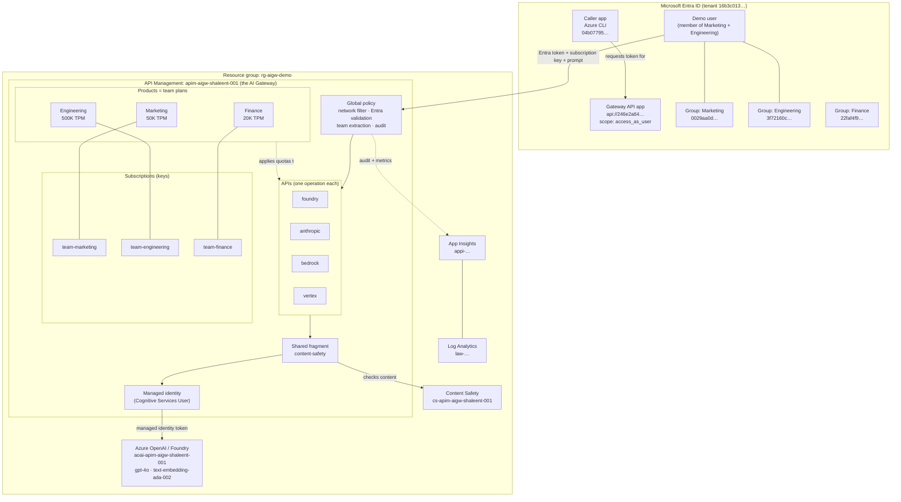

# Enterprise AI Gateway — Demo Cookbook

A complete, beginner-friendly guide to understanding and running the demos in this
repository. If you have never worked with APIs, Azure API Management (APIM), or AI
gateways, read Part 1 first. If you just want to run the demos, jump to Part 4.

---

## Table of contents

- [Part 1 — Concepts for absolute beginners](#part-1--concepts-for-absolute-beginners)
- [Part 2 — What this lab is and what we prove](#part-2--what-this-lab-is-and-what-we-prove)
- [Part 3 — The environment (what is already deployed)](#part-3--the-environment-what-is-already-deployed)
- [Part 4 — One-time setup before any demo](#part-4--one-time-setup-before-any-demo)
- [Part 5 — The demos, step by step](#part-5--the-demos-step-by-step)
- [Part 6 — Reset and cleanup](#part-6--reset-and-cleanup)
- [Part 7 — Troubleshooting](#part-7--troubleshooting)
- [Part 8 — Glossary](#part-8--glossary)

---

## Part 1 — Concepts for absolute beginners

Read this once. Every demo depends on these five ideas.

### 1.1 What is an API?

An **API** is a way for one program to ask another program to do something over the
network. You send a request to a URL; you get a response back. When an application
uses GPT-4o, it sends an API request to the model and receives the model's answer.

### 1.2 What is a model API key?

Normally, to call an AI model directly, you need a **secret key**. Anyone who has that
key can use the model, spend money, and see data. Keys get copied into code, laptops,
and config files — which is a security problem.

### 1.3 What is Azure API Management (APIM)?

**APIM** is a "front door" that sits in front of other APIs. Instead of letting
applications call the model directly, everyone calls APIM. APIM can check who you are,
enforce limits, block unsafe content, and record what happened — all before the real
model is ever contacted.

### 1.4 What is an "AI Gateway"?

An **AI Gateway** is APIM configured specifically to govern AI models. It gives an
enterprise **one controlled entry point** for all AI usage, instead of many
applications each holding their own model keys.

```text
Without a gateway:            With this AI Gateway:

App ──► Model (with key)      App ──► APIM ──► Model
App ──► Model (with key)              (identity, limits,
App ──► Model (with key)               safety, logging)
```

### 1.5 The two different identities (this is the key idea)

There are **two separate trust relationships** in every demo:

| Question | Who answers it | How |
|---|---|---|
| "Who is the **caller**?" | Microsoft Entra ID | The user signs in and gets an **access token** |
| "Who is calling the **model**?" | APIM's own identity | APIM uses a **managed identity** to reach Foundry |

The caller **never** holds a Foundry key. The user proves their identity to the
gateway; the gateway proves its identity to the model. That is what we mean by
**"keyless" access to the model**.

### 1.6 Two credentials the caller *does* send

Each request to the gateway carries two things:

1. **Entra access token** → answers *"Who are you, and which team are you on?"*
2. **APIM subscription key** → answers *"Which team plan / allocation are you using?"*

> An **APIM subscription key** is NOT a model key. It is a per-team ticket that maps
> the request to that team's quotas and policies. Marketing, Engineering, and Finance
> each have their own subscription key.

---

## Part 2 — What this lab is and what we prove

### 2.1 The business story

Imagine a company where many teams want to use AI models. Leadership is worried about:

- People keeping model keys forever, even after they leave a team
- Teams spending unlimited money on tokens
- Model keys leaking into laptops and source code
- Every team building its own security in a different way
- Finance being unable to say which team spent what

This lab is a **reference implementation** that solves those problems with one governed
gateway in front of Microsoft Foundry (Azure OpenAI).

### 2.2 The seven problems and how the gateway solves them

| # | Problem | What proves it is solved |
|---|---|---|
| 1 | Access is never revoked | Remove a user from a team group → their next token is rejected |
| 2 | Runaway spend | Per-team token/request/day limits return `429` when exceeded |
| 3 | Model keys everywhere | The caller sends **no** model key; APIM injects identity |
| 4 | Vendor sprawl | The same request shape works across Foundry and other vendors |
| 5 | No chargeback | Usage metrics tagged with Team + Cost Center feed KQL reports |
| 6 | Leaked-key blast radius | Network restriction + identity + subscription all required |
| 7 | Inconsistent governance | One shared content-safety policy fragment used by all APIs |

### 2.3 The lab structure at a glance

To make the demos work, the lab wires together three layers: **identity** (Entra ID),
the **gateway** (APIM), and the **backing Azure services**. The diagram shows what was
created and how the pieces connect.



**How to read it:**

- **Entra ID** holds the three team **groups**, the **gateway app** (whose ID is the
  token audience), and the **caller app** (Azure CLI) that is allowed to request tokens.
  The demo user belongs to Marketing and Engineering, but not Finance.
- **APIM** is the gateway. Every request hits the **global policy** first, then an
  **API** (one per vendor), governed by the caller's **product/team plan** and its
  **subscription key**. All APIs share one **content-safety fragment**, and APIM uses
  its **managed identity** to reach Foundry with no stored key.
- **Backing services**: Foundry hosts the models, Content Safety screens content, and
  App Insights + Log Analytics capture audit and chargeback telemetry.

### 2.4 What "success" looks like in a demo

For each demo you will show **two halves**:

1. **The happy path** — a correctly authorized request works.
2. **The control** — remove one requirement, and the gateway blocks the request.

Showing the block is as important as showing the success. It proves the control is real.

---

## Part 3 — The environment (what is already deployed)

Everything below is **already running** in Azure. You do not need to build it. The lab
was deployed with Terraform from the [infra/](infra) folder.

### 3.1 Azure resources

| Resource | Name | Purpose |
|---|---|---|
| Resource group | `rg-aigw-demo` | Holds everything |
| API Management | `apim-aigw-shaleent-001` | The AI Gateway (public hostname) |
| Azure OpenAI (Foundry) | `aoai-apim-aigw-shaleent-001` | Hosts the models |
| Model deployment | `gpt-4o` | Chat model used by the demos |
| Model deployment | `text-embedding-ada-002` | Used by semantic cache |
| Content Safety | `cs-apim-aigw-shaleent-001` | Blocks harmful content |
| Application Insights | `appi-apim-aigw-shaleent-001` | Telemetry + KQL |
| Log Analytics | `law-apim-aigw-shaleent-001` | Log storage |

### 3.2 Identity and teams

| Item | Value |
|---|---|
| Tenant ID | `16b3c013-d300-468d-ac64-7eda0820b6d3` |
| Gateway API app (audience) | `api://246e2a64-1f33-4479-b7b6-3b2cb348ab1f` |
| Caller app (Azure CLI) | `04b07795-8ddb-461a-bbee-02f9e1bf7b46` |
| Delegated scope | `access_as_user` |
| Marketing group | `0029aa0d-2f9a-4921-b4a5-59a2a6658f79` |
| Engineering group | `3f72160c-4f5f-49ec-9958-91a526325be3` |
| Finance group | `22faf4f9-3b96-4586-94d1-4a396e3d4ded` |

> The signed-in demo user is a member of **Marketing** and **Engineering**, but **not
> Finance**. This is intentional — it lets you demonstrate the access-revocation and
> unauthorized-team scenarios.

### 3.3 The team plans (quotas)

Each team is an APIM **Product** with its own limits, defined in
[policies/](policies):

| Team | Tokens/min | Requests/min | Tokens/day | Policy file |
|---|---|---|---|---|
| Marketing | 50,000 | 500 | 5,000,000 | [product-team-marketing.xml](policies/product-team-marketing.xml) |
| Engineering | 500,000 | 5,000 | 50,000,000 | [product-team-engineering.xml](policies/product-team-engineering.xml) |
| Finance | 20,000 | 200 | 2,000,000 | [product-team-finance.xml](policies/product-team-finance.xml) |

### 3.4 The policies that enforce governance

| Policy | Scope | What it does |
|---|---|---|
| [global.xml](policies/global.xml) | All APIs | Network filter, Entra validation, team extraction, audit logging |
| [fragment-content-safety.xml](policies/fragment-content-safety.xml) | Shared | Content safety + jailbreak detection, reused by every API |
| [api-foundry.xml](policies/api-foundry.xml) | Foundry API | Strips keys, managed-identity auth, token limits, cache, metrics |

### 3.5 The request path (what happens on every call)

```text
You (PowerShell)
  │  Entra token + Marketing subscription key + prompt
  ▼
APIM operation match  (/foundry/openai/deployments/{deployment}/chat/completions)
  ▼
global.xml         → network check → validate Entra token → check team group
                     → derive Team + Cost Center → write audit trace
  ▼
product policy     → apply Marketing token/request/day limits
  ▼
api-foundry.xml    → content safety → delete caller keys
                     → get managed-identity token → call Foundry
  ▼
Foundry gpt-4o     → generates the answer
  ▼
APIM               → emit token metrics → return response
```

---

## Part 4 — One-time setup before any demo

Do these once per machine / per demo session.

### 4.1 Confirm you are signed in to the right subscription

```powershell
az account show --query "{name:name, id:id, user:user.name}" -o table
```

Expected: subscription `shaleent-MCAPS-Hybrid`
(`09e7c1cb-53ca-4d05-bcf0-8881c42e680e`), user `shaleent@microsoft.com`.

If not, sign in:

```powershell
az login --tenant "16b3c013-d300-468d-ac64-7eda0820b6d3"
```

### 4.2 Understand the network switch (read before running from your laptop)

The gateway has a network guardrail controlled by one Terraform variable in
[infra/terraform.tfvars](infra/terraform.tfvars):

```hcl
enable_private_ip_filter = true
```

- **`true`** → APIM only accepts requests from **private** corporate address ranges
  (`10.x`, `172.16–31.x`, `192.168.x`). Your laptop reaches Azure over the public
  internet, so APIM sees a **public** IP and returns
  `403 private_only`. Identity and everything else still work — the request is simply
  stopped at the network layer.
- **`false`** → APIM removes only that network filter. **All other controls remain**
  (Entra token, team check, subscription key, quotas, content safety, managed
  identity). This lets you demo from a normal laptop.

> Setting it to `false` does **not** make the gateway unprotected. A caller still needs
> a valid tenant token with the right team claim **and** a valid APIM subscription key.
> It only removes the source-IP restriction.

**For demos run from your laptop, set it to `false` (Demo 0 below). Restore it to
`true` afterwards.** For a production-accurate demo, keep it `true` and run from a VM
inside an Azure VNet or over corporate VPN.

### 4.3 Helper: load reusable demo variables

Paste this block once per PowerShell session. Later demos reuse `$gateway`, `$token`,
and the subscription-key helper.

```powershell
# --- Identity + gateway constants ---
$tenant   = "16b3c013-d300-468d-ac64-7eda0820b6d3"
$appId    = "246e2a64-1f33-4479-b7b6-3b2cb348ab1f"
$subId    = "09e7c1cb-53ca-4d05-bcf0-8881c42e680e"
$gateway  = "https://apim-aigw-shaleent-001.azure-api.net"
$apimName = "apim-aigw-shaleent-001"
$rg       = "rg-aigw-demo"

# --- Get a delegated Entra token for the gateway ---
$token = az account get-access-token `
  --tenant $tenant `
  --scope "api://$appId/access_as_user" `
  --query accessToken -o tsv

# --- Helper to fetch a team subscription key (no key is printed) ---
function Get-TeamKey($team) {
  $url = "https://management.azure.com/subscriptions/$subId/resourceGroups/$rg/providers/Microsoft.ApiManagement/service/$apimName/subscriptions/$team/listSecrets?api-version=2024-05-01"
  az rest --method post --url $url --query primaryKey -o tsv
}

Write-Host "Setup complete. Token acquired and helper loaded."
```

---

## Part 5 — The demos, step by step

Each demo has: **Goal → What you show → Steps → What to say → The control (block)**.

> Demo 0 is required only if you are running from a public workstation.

---

### Demo 0 — Enable public reachability for a laptop demo

**Goal:** allow your laptop to reach the gateway while keeping every identity control.

**Steps**

1. Open [infra/terraform.tfvars](infra/terraform.tfvars) and set:

   ```hcl
   enable_private_ip_filter = false
   ```

2. Apply the change:

   ```powershell
   terraform -chdir=infra plan -out=tfplan-demo
   terraform -chdir=infra apply tfplan-demo
   ```

**What to say**

> "For this portable demo I am turning off only the network IP restriction. Identity,
> team authorization, subscription keys, quotas, content safety, and managed-identity
> access to the model all remain fully enforced."

> Remember to run [Demo 6](#demo-6--restore-private-only-posture) at the end.

---

### Demo 1 — Keyless, identity-controlled access to Foundry

**Goal:** prove an app can use GPT-4o through the gateway **without any model key**.

**What you show:** a normal chat request succeeds; it carries an Entra token and a team
subscription key, but no Foundry key; the response includes token usage.

**Steps** (run the Part 4.3 setup block first)

```powershell
$key = Get-TeamKey "team-marketing"

$headers = @{
  Authorization               = "Bearer $token"
  "Ocp-Apim-Subscription-Key" = $key
  "Content-Type"              = "application/json"
}

$body = @{
  messages = @(
    @{ role = "system"; content = "You are a concise enterprise cloud assistant." },
    @{ role = "user";   content = "Explain the value of an AI Gateway in exactly three bullets." }
  )
  max_tokens = 150
} | ConvertTo-Json -Depth 10

$response = Invoke-RestMethod -Method Post `
  -Uri "$gateway/foundry/openai/deployments/gpt-4o/chat/completions?api-version=2024-10-21" `
  -Headers $headers -Body $body

$response.choices[0].message.content
$response.usage | Format-List
```

**What to point out**

1. The URL is the **APIM** hostname, not the Foundry endpoint.
2. There is an **Entra token** (who the user is).
3. There is a **Marketing subscription key** (which team plan).
4. There is **no Foundry API key** anywhere.
5. The model answers, and `usage` shows tokens consumed.

**What to say**

> "The user authenticated to the gateway; the gateway authenticated to the model. Those
> are two separate trust relationships. No model key ever touches the client."

**The control (block):** remove the subscription key and call again — it is rejected
because the product subscription is required.

```powershell
$noKey = @{ Authorization = "Bearer $token"; "Content-Type" = "application/json" }
try {
  Invoke-RestMethod -Method Post `
    -Uri "$gateway/foundry/openai/deployments/gpt-4o/chat/completions?api-version=2024-10-21" `
    -Headers $noKey -Body $body
} catch {
  "Blocked as expected: HTTP $([int]$_.Exception.Response.StatusCode)"
}
```

---

### Demo 2 — Access revocation via team membership

**Goal:** show that removing someone from a team instantly revokes their access.

**What you show:** a Finance-only call fails because the demo user is **not** in Finance;
conceptually the same mechanism revokes a departed employee.

**Steps**

```powershell
# The signed-in user is NOT in Finance. Using the Finance key still fails identity
# because the token has no Finance group claim.
$financeKey = Get-TeamKey "team-finance"

$headers = @{
  Authorization               = "Bearer $token"
  "Ocp-Apim-Subscription-Key" = $financeKey
  "Content-Type"              = "application/json"
}

try {
  Invoke-RestMethod -Method Post `
    -Uri "$gateway/foundry/openai/deployments/gpt-4o/chat/completions?api-version=2024-10-21" `
    -Headers $headers -Body $body
} catch {
  "Blocked as expected: HTTP $([int]$_.Exception.Response.StatusCode)"
}
```

**What to say**

> "Access is driven by Entra group membership carried in the token. When someone leaves
> a team, their next token no longer contains that group, and the gateway rejects them.
> There is no long-lived key to hunt down and revoke."

**Live variation (optional):** remove yourself from the Marketing group in Entra, run
`az login` again to refresh the token, and repeat Demo 1 — it now fails. Re-add yourself
afterwards.

---

### Demo 3 — Per-team spend limits (quotas)

**Goal:** show that each team has enforced token/request limits.

**What you show:** the limits are defined per product; a large burst against a low tier
eventually returns `429 Token Limit Exceeded`.

**Steps**

```powershell
$key = Get-TeamKey "team-marketing"
$headers = @{
  Authorization               = "Bearer $token"
  "Ocp-Apim-Subscription-Key" = $key
  "Content-Type"              = "application/json"
}
$big = @{
  messages = @(@{ role = "user"; content = "Write a very long, detailed 2000-word essay on cloud governance." })
  max_tokens = 4000
} | ConvertTo-Json -Depth 10

# Fire several large requests; watch the remaining-tokens header shrink, then 429.
1..8 | ForEach-Object {
  try {
    $r = Invoke-WebRequest -Method Post `
      -Uri "$gateway/foundry/openai/deployments/gpt-4o/chat/completions?api-version=2024-10-21" `
      -Headers $headers -Body $big
    "Call $_`: HTTP $([int]$r.StatusCode)  remaining=$($r.Headers['x-tokens-remaining'])"
  } catch {
    "Call $_`: HTTP $([int]$_.Exception.Response.StatusCode)  (limit hit)"
  }
}
```

**What to say**

> "Marketing is capped at 50,000 tokens per minute; Engineering at 500,000. When a team
> exceeds its allocation, the gateway returns 429 and protects both the budget and the
> shared backend. Compare the Marketing and Engineering tiers in the policy files."

**Reference:** [product-team-marketing.xml](policies/product-team-marketing.xml) vs
[product-team-engineering.xml](policies/product-team-engineering.xml).

---

### Demo 4 — Consistent governance with a shared policy fragment

**Goal:** show that safety rules are written once and reused everywhere.

**What you show:** the same content-safety fragment is included by every vendor API, so
one change updates all of them.

**Steps** (this is a code walkthrough, not a request)

1. Open [policies/fragment-content-safety.xml](policies/fragment-content-safety.xml).
   Point out the Hate / Sexual / SelfHarm / Violence thresholds and `shield-prompt`
   (jailbreak detection).
2. Open [policies/api-foundry.xml](policies/api-foundry.xml) and find:

   ```xml
   <include-fragment fragment-id="fragment-content-safety" />
   ```

3. Note that the same include appears in the Anthropic, Bedrock, and Vertex API policies.

**What to say**

> "Every team writing its own safety middleware leads to drift. Here, safety is one
> shared fragment. Change it once, and all APIs inherit the update — consistent
> Responsible AI governance across every model vendor."

---

### Demo 5 — Chargeback and audit with KQL

**Goal:** show finance-grade visibility into who spent what.

**What you show:** Application Insights queries that attribute token usage to teams and
cost centers, and an audit of denied requests.

**Steps**

1. Generate some traffic first (run Demo 1 a few times so metrics exist).
2. In the Azure portal, open Application Insights
   `appi-apim-aigw-shaleent-001` → **Logs**.
3. Paste queries from [demo/kql-queries.md](demo/kql-queries.md), for example
   **tokens per team** and **chargeback per cost center**.

**What to say**

> "Because the gateway tags every call with Team and Cost Center, finance can attribute
> spend precisely and even convert tokens to dollars. The same log stream shows who was
> denied and why, for audit."

> Metrics can take a few minutes to appear after traffic.

---

### Demo 6 — Restore private-only posture

**Goal:** return the environment to its secure default after a laptop demo.

**Steps**

1. Open [infra/terraform.tfvars](infra/terraform.tfvars) and set:

   ```hcl
   enable_private_ip_filter = true
   ```

2. Apply:

   ```powershell
   terraform -chdir=infra plan -out=tfplan-restore
   terraform -chdir=infra apply tfplan-restore
   ```

3. Confirm the guardrail is back: a laptop call now returns `403 private_only`.

**What to say**

> "In production the gateway is reached privately over a VNet or VPN. The IP filter is
> an extra guardrail on top of private networking, not a replacement for it."

---

## Part 6 — Reset and cleanup

- **Between demos:** nothing to reset; policies and limits are stateful in APIM and
  reset on their own renewal windows (per-minute / daily).
- **End of session on a laptop:** run [Demo 6](#demo-6--restore-private-only-posture)
  to re-enable the IP filter.
- **Tear everything down (optional):**

  ```powershell
  terraform -chdir=infra destroy
  ```

  This deletes all Azure resources in `rg-aigw-demo`. The Entra app registration and
  security groups are not managed by Terraform and would be removed separately.

---

## Part 7 — Troubleshooting

| Symptom | Meaning | Fix |
|---|---|---|
| `403 private_only` | IP filter is on and you are on a public IP | Run Demo 0 (`enable_private_ip_filter = false`) or call from a private network |
| `404 Resource not found` | The path did not match an API operation | Check the URL and `api-version`; operations are defined in [infra/apis.tf](infra/apis.tf) |
| `401 Unauthorized` | Token invalid, expired, or missing team group | Re-run `az login` with the scope; confirm group membership |
| `Subscription key` error | Missing/wrong `Ocp-Apim-Subscription-Key` | Use `Get-TeamKey` for the correct team |
| `429 Token Limit Exceeded` | Team quota reached | Expected in Demo 3; wait for the per-minute reset or use Engineering tier |
| `consent_required` on `az login` | CLI not yet authorized for the scope | Run `az login --tenant <tenant> --scope "api://<appId>/access_as_user"` |
| No data in KQL | Metrics not ingested yet | Generate traffic, wait a few minutes, re-run the query |

---

## Part 8 — Glossary

| Term | Plain-English meaning |
|---|---|
| **API** | A way for programs to talk over the network via requests and responses |
| **APIM** | Azure API Management — the "front door" in front of other APIs |
| **AI Gateway** | APIM configured to govern AI models |
| **Microsoft Foundry / Azure OpenAI** | The Azure service that hosts models like GPT-4o |
| **Deployment** | A named, versioned instance of a model you call (e.g. `gpt-4o`) |
| **Entra ID** | Microsoft's identity service; issues sign-in tokens |
| **Access token** | Proof of who the caller is, sent as `Authorization: Bearer ...` |
| **Managed identity** | An Azure identity APIM uses to call Foundry without a stored key |
| **APIM subscription key** | A per-team ticket mapping a request to that team's plan/quotas |
| **Product** | An APIM grouping of APIs with a shared policy (used here as a "team plan") |
| **Policy** | Rules APIM runs on each request (auth, limits, safety, logging) |
| **Policy fragment** | A reusable block of policy shared across multiple APIs |
| **Token (AI)** | A unit of text the model processes; usage and cost are measured in tokens |
| **RFC1918** | The private IP ranges (`10.x`, `172.16–31.x`, `192.168.x`) |
| **Chargeback** | Attributing cloud spend back to the team that incurred it |

---

*You are ready. Read Part 1, run Part 4 once, then work through the demos in Part 5.*
